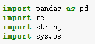

# wfrequency

## 2020.06.16更新版本：2.0

### 新增
* 增加单词自动翻译
* 导出为Excle表格

### 说明:
* 用来提取英语文章中的用到的词语与词频，并自动翻译
* 希望通过这个小工具促进自己的英语写作

### 使用方式:

1. 安装python,以及安装相应库  

2. 调整注册表(DropHandler),使.py支持拖拽
3. 安装词典stardict.csv
4. 拖拽到wfrequency.py，完成

### 安装词典说明：
1. 下载词典[stardict.7z](https://github.com/skywind3000/ECDICT/raw/master/stardict.7z)
2. 解压得到stardict.csv
3. 将csv文件放在与wfrequency.py同目录下

### 感谢:
<https://github.com/skywind3000/ECDICT>  
<http://www.51testing.com/html/53/61753-154953.html>  
<https://www.zhihu.com/zvideo/1217521158570344448>  
<http://www.cocoachina.com/cms/wap.php?action=article&id=81912>  