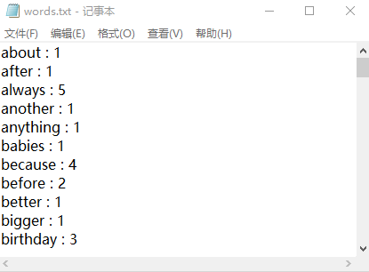

# wfrequency

### 说明:
* 用来提取英语文章中的用到的**词语**与**词频**
* 希望通过这个小工具促进自己的英语写作

### 使用方式:

1. 安装python,以及使用正则表达式的re库
2. 调整注册表(DropHandler),使.py支持拖拽
3. 拖拽到wfrequency.py，完成

### 感谢:
<http://www.51testing.com/html/53/61753-154953.html>  